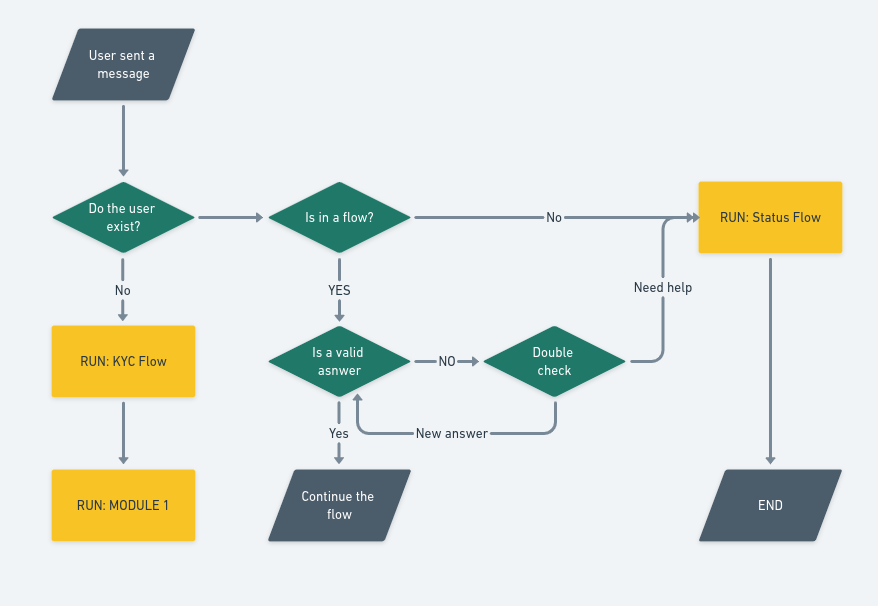
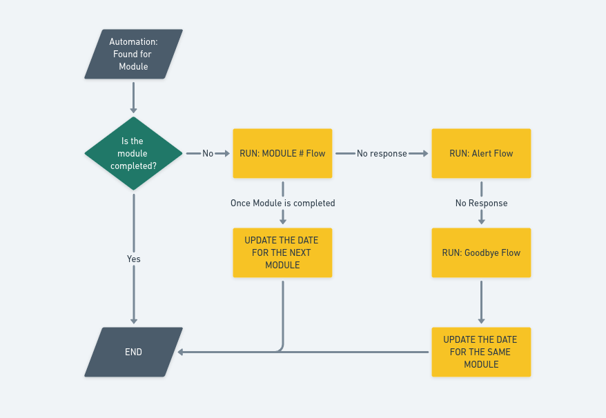

# Juntina chatbot

## Runtime

- Typescript 5.1
- node v18.12.0
- MongoDB
- Mongoose
- Ngrok
- RabbitMQ

## Proyecto

### Env

Copia las `.env.example` a `.env`

- `NODE_ENV`
- `DIALOG_BASE_URL`
- `DIALOG_TOKEN`
- `CRONJOB_TIMEZONE`
- `PORT`
- `DB_URI`

### Instalar dependencias
 - ```yarn install```

### Levantar RabbitMQ en Docker
- ```docker run -d -p 15672:15672 -p 5672:5672 --name rabbitmq rabbitmq:3-management```

### Instalar Nrgrok

- ```https://ngrok.com/download```

### Levantar el proyecto
Ejecutar secuencialmente estos comandos
- ```yarn build:watch```
- ```yarn dev```
- ```yarn ngrok```

### Postman

Descargar postman del proyecto

- ```https://api.postman.com/collections/10805696-a1b7562e-34e8-4479-9498-5ff9da8275d5?access_key=PMAT-01HG8PP7P4WPJVQJ1HM56XRHSN```

- {{URL}} = ```https://waba-sandbox.360dialog.io```

## Enviar primer mensaje con 360Dialog

### Genera el API-KEY de 360Dialog
- Genera el `api-key` de 360Dialog abriendo el siguiente link: ```https://wa.me/4930609859535?text=START```

- En los `Headers` de cada endpoint del Postman debes colocar el `D360-Api-Key` = `api-key` generado
### Configura tu webhook

- Selecciona desde el Postman el servicio llamado `Webhook register ( {{URL}}/v1/configs/webhook )`

- En el body: 
```
{
    "url" : "{{{ngrok-url}}/api/meta/webhook"
}
``` 

- Comprueba el webook registrado en `{{URL}}/v1/configs/webhook` 

### Enviar el mensaje


- Selecciona desde el Postman el servicio llamado `Send Text Message ( {{URL}}/v1/messages )`

- En el body: 
```
{
    "to": "codigo+numero", //(ej: 51912321321)
    "type": "text",
    "text": {
        "body": "Mi primer mensaje"
    }
}
``` 

#### Webhook flow




#### Cronjob Flow


